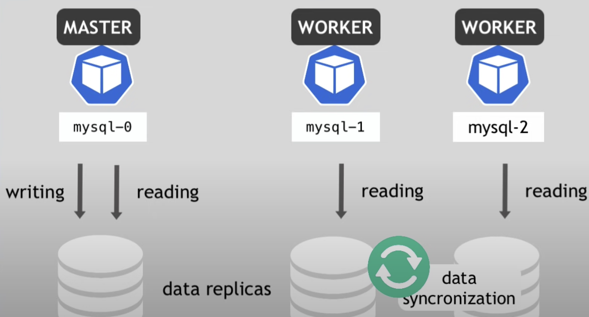

# Week 2 [09012023 - 13012023:]

## ================ What is VeChainThor ? ================

Ethereum has proven to be unsuitable for hosting large-scale commercial decentralized applications (dApps). One of the main reasons for this is that there hasn’t been an effective governance structure set up from Ethereum’s very beginning that would allow efficient and transparent transitions (upgrades) of the protocol to adapt to new challenges or innovations. 

Secondly, Ethereum lacks a suitable economic model to allow enterprises to run their dApps with a controllable and predictable cost. Considering the level of volatility of the ether price, it is almost impossible for companies to predict the future price of Ether or the cost of running a dApp based on Ethereum for a given period of time.

Features of VeChainThor:

<ul>
	<li>Meta-transaction Features</li>
	<li>Proof of Authority (PoA)</li>
	<li>Governance</li>
	<li>Economic Model</li>
</ul>

https://docs.vechain.org/thor/learn/
https://cointelegraph.com/news/what-is-vechain-vet-and-how-does-it-work

## =================== What is NEAR ? ===================

NEAR is a user-friendly and carbon-neutral blockchain, built from the ground up to be performant, secure, and infinitely scalable. In technical terms, NEAR is a layer one, sharded, proof-of-stake blockchain built with usability in mind.

<ul>
	<li>Carbon-neutral protocol -> supports tree-planting/ green programs.</li>
	<li>Nightshade Sharding ->  a partitioning of the NEAR protocol, splits the work of processing transactions across many participating nodes.</li>
	<li>Proof-of-Stake -> For the blockchain to remain secure, it must have a mechanism to prevent a malicious user or group from taking over a majority of validation. PoS accomplishes this by requiring that validators have some quantity of blockchain tokens, requiring potential attackers to acquire a large fraction of the tokens on the blockchain to mount an attack.</li>
</ul>

https://docs.near.org/concepts/basics/protocol

## ================= Kubernetes Recap 0: =================

Deploying simple 2 pods of Nginx via yaml file:
- https://kubernetes.io/docs/tasks/run-application/run-stateless-application-deployment/

Deploying pure Ubuntu pods via yaml file:
- https://computingforgeeks.com/deploy-ubuntu-pod-in-kubernetes-openshift/

SSH into Pods:

```bash
	$ kubectl exec --stdin --tty ubuntu -- /bin/bash
```

-  stdin -> Pass stdin to the container
-  tty -> Stdin is a TTY

Printing ALL ingress/pods across different namespaces:

```bash
	$ kubectl get ingress -A
	$ kubectl get pods -A
```

Checking Ubuntu OS version:

```bash
	$ cat etc/os-release
``` 

Installing docker on Ubuntu 20.04:
- https://www.digitalocean.com/community/tutorials/how-to-install-and-use-docker-on-ubuntu-20-04

Publishing Services:
- https://kubernetes.io/docs/concepts/services-networking/service/
- https://kubernetes.io/docs/tutorials/services/connect-applications-service/

### -------------------------------- Kubernetes Services --------------------------------

The goal of a kubernetes service is to provide an abstraction layer to help with loose coupling (to interconnect components in a system). A Kubernetes Service works by identifying a set of Pods using label selectors. Unless mentioned otherwise, Services are assumed to have virtual IPs only routable within the cluster network.


When you are working with multi-port containers, you HAVE to name the ports in your services.


ClusterIP: Exposes the Service on a cluster-internal IP. Choosing this value makes the Service only reachable from within the cluster. This is the default that is used if you don't explicitly specify a type for a Service.

Headless Service: Meant for stateful resources when you intend to point to a specific IP and port of the pod in question. To do so, you are required manually set the ClusterIP to "None". 


Note: when you deploy a headless service, it will always be IN CONJUNCTION with another service. In the above example, the usual ClusterIP service is used to route normal clients' requests from the pod, while the headless service is only used to route requests directly into the mongo-db, and for the mongo-db applications to communicate with one another.

https://stackoverflow.com/questions/52707840/what-is-a-headless-service-what-does-it-do-accomplish-and-what-are-some-legiti


NodePort: Exposes the Service (arguably ClusterIP) on each Node's IP at a static port (the NodePort). To make the node port available, Kubernetes sets up a cluster IP address, the same as if you had requested a Service of type: ClusterIP.


Note: by opening up the ports to ANY single of your worker nodes, you are exposing dangers to your entire system as your Service (that randomly routes traffic to pods across different worker nodes) will now compromise your entire system.


LoadBalancer: Exposes the Service (NodePort) externally using a cloud provider's load balancer. Therefore, under the hood of your cloud provider's security policies etc. (protecting your LB's external IP), you have greater security that prevents external access into your cluster.

ExternalName: Maps the Service to the contents of the externalName field (e.g. foo.bar.example.com), by returning a CNAME record with its value. No proxying of any kind is set up.

When do we use ExternalName? There are often times when you will need to access an external service in Kubernetes but still want to use a static name. For example, you have an external database like an AWS RDS (MySQL) hosted by Amazon. In your application, you simply want to refer to this database by the name mysql and not the ful URL of the name that AWS assigns to it.

Deploying with AWS ALB:

- https://docs.aws.amazon.com/eks/latest/userguide/alb-ingress.html
- https://medium.com/tensult/alb-ingress-controller-on-aws-eks-45bf8e36020d
- https://www.middlewareinventory.com/blog/internal-external-load-balancer-aws-eks/

### --------------------------------- Kubernetes Ingress ---------------------------------


Be it via a NodePort or a Loadbalancer, exposing an application via its External Service (IP address and/or port) is not production quality, imposing many security concerns.


Ingress exposes HTTP and HTTPS routes from outside the cluster to services within the cluster. Traffic routing is controlled by rules defined on the Ingress resource. An Ingress may be configured to give Services externally-reachable URLs, load balance traffic, terminate SSL / TLS, and offer name-based virtual hosting.


Note: when configuring an Ingress, we use a typeless service (arguably ClusterIP).


Note: we need to deploy an Ingress Controller in conjunction with the Ingress service to help evaluate the rules, manage re-direction and serve as an ENTRYPOINT to the cluster.


Above is a common bare-metal architecture for Ingress implementation. We use a reverse proxy to route traffic to the Ingress Controller (Pod).


Else, for a more production-level architecture, you will configure a CSP's Load Balancer as the entry pointn to your cluster as shown above.


Difference between Volumes and PersistentVolumes: 

<ul>
	<li>A Volume separates storage from a container but binds it to a Pod, while PVs separate storage from a Pod.</li>
	<li>The lifecycle of a Volume is dependent on the Pod using it, while the lifecycle of a PV is not.</li>
	<li>A Volume enables safe container restart and allows sharing of data across containers, whereas a PV enables safe Pod termination or restart.</li>
	<li>A separate manifest YAML file is needed to create a PV, but not required for a volume.</li>
</ul>

Storage management is essential in Kubernetes, especially in  large environments where many users deploy multiple Pods. The users in this environment often need to configure storage for each Pod, and when making a change to existing applications, it must be made on all Pods, one after the other. To mitigate this time-consuming scenario and separate the details of how storage is provisioned from how it is consumed, we use PersistentVolumes (PVs) and PersistentVolumeClaims (PVCs).

Difference between PersistentVolumes (PVs) and PersistentVolumeClaims (PVCs):


<ul>
	<li>PVs are created by the cluster administrator or dynamically by Kubernetes, whereas users/developers create PVCs.</li>
	<li>PVs are cluster resources provisioned by an administrator, whereas PVCs are a user’s request for storage and resources.</li>
	<li>PVCs consume PVs resources, but not vice versa.</li>
	<li>A PV is similar to a node in terms of cluster resources, while a PVC is like a Pod in the context of cluster resource consumption.</li>
</ul>

https://www.kubermatic.com/blog/keeping-the-state-of-apps-4-persistentvolumes-and-persistentvolum/#:~:text=PVs%20are%20cluster%20resources%20provisioned,context%20of%20cluster%20resource%20consumption.

Deployment is a Kubernetes controller that matches the current state of your cluster to the desired state mentioned in the Deployment manifest. e.g. If you create a deployment with 1 replica, it will check that the desired state of ReplicaSet is 1 and current state is 0, so it will create a ReplicaSet, which will further create the pod.

Deployments are usually used for stateless applications. However, you can save the state of deployment by attaching a Persistent Volume to it and make it stateful, but all the pods of a deployment will be sharing the same Volume and data across all of them will be same.


Deployments, as discussed, creates a ReplicaSet which then creates a Pod so whenever you update the deployment using RollingUpdate(default) strategy, a new ReplicaSet is created and the Deployment moves the Pods from the old ReplicaSet to the new one at a controlled rate. Rolling Update means that the previous ReplicaSet doesn’t scale to 0 unless the new ReplicaSet is up & running ensuring 100% uptime. If an error occurs while updating, the new ReplicaSet will never be in Ready state, so old ReplicaSet will not terminate again ensuring 100% uptime in case of a failed update. In Deployments, you can also manually roll back to a previous ReplicaSet, if needed in case if your new feature is not working as expected.

StatefulSet is also a Controller but unlike Deployments, it doesn’t create ReplicaSet rather itself creates the Pod with a unique naming convention. e.g. If you create a StatefulSet with name counter, it will create a pod with name counter-0, and for multiple replicas of a statefulset, their names will increment like counter-0, counter-1, counter-2, etc

Every replica of a stateful set will have its own state, and each of the pods will be creating its own PVC(Persistent Volume Claim). So a statefulset with 3 replicas will create 3 pods, each having its own Volume, so total 3 PVCs.

StatefulSets don’t create ReplicaSet or anything of that sort, so you cant rollback a StatefulSet to a previous version. You can only delete or scale up/down the Statefulset. If you update a StatefulSet, it also performs RollingUpdate i.e. one replica pod will go down and the updated pod will come up, then the next replica pod will go down in same manner e.g. If I change the image of the above StatefulSet, the counter-2 will terminate and once it terminates completely, then counter-2 will be recreated and counter-1 will be terminated at the same time, similarly for next replica i.e. counter-0. If an error occurs while updating, so only counter-2 will be down, counter-1 & counter-0 will still be up, running on previous stable version.

Statefulsets vs Deployments (Stateless applications)

- Blockchain nodes are like your databases (stateful applications)
- REST APIs and Flask Applications are like your deployments

StatefulSets are useful in case of Databases especially when we need Highly Available Databases in production as we create a cluster of Database replicas with one being the primary replica and others being the secondary replicas. The primary will be responsible for read/write operations and secondary for read only operations and they will be syncing data with the primary one.


If the primary goes down, any of the secondary replica will become primary and the StatefulSet controller will create a new replica in account of the one that went down, which will now become a secondary replica. Note that when a new replica (worker pod) is spun up, it will take the state from another workder node instead.




A DaemonSet is a controller that ensures that the pod runs on all the nodes of the cluster. If a node is added/removed from a cluster, DaemonSet automatically adds/deletes the pod. Some typical use cases of a DaemonSet is to run cluster level applications like:

- Monitoring Exporters: You would want to monitor all the nodes of your cluster so you will need to run a monitor on all the nodes of the cluster like NodeExporter.

- Logs Collection Daemon: You would want to export logs from all nodes so you would need a DaemonSet of log collector like Fluentd to export logs from all your nodes.

However, Daemonset automatically doesn’t run on nodes which have a taint e.g. Master. You will have to specify the tolerations for it on the pod.


When you deploy the daemonset, it will create pods equal to the number of nodes. In terms of behavior, it will behave the same as Deployments i.e. all pods will share the same Persistent Volume and are stateless pods.


If you update a DaemonSet, it also performs RollingUpdate i.e. one pod will go down and the updated pod will come up, then the next replica pod will go down in same manner e.g. If I change the image of the above DaemonSet, one pod will go down, and when it comes back up with the updated image, only then the next pod will terminate and so on. If an error occurs while updating, so only one pod will be down, all other pods will still be up, running on previous stable version. Unlike Deployments, you cannot roll back your DaemonSet to a previous version.

https://medium.com/stakater/k8s-deployments-vs-statefulsets-vs-daemonsets-60582f0c62d4

### ---------------------------- Using Velero to backup PVCs ----------------------------

GitOps is already used to enable rollbacks for kubernetes resources. However, you are unable to backup PVCs. -> hence use Velero

https://velero.io/docs/v1.10/how-velero-works/